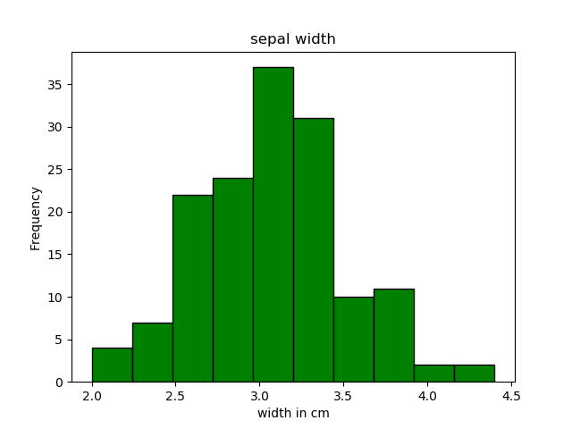
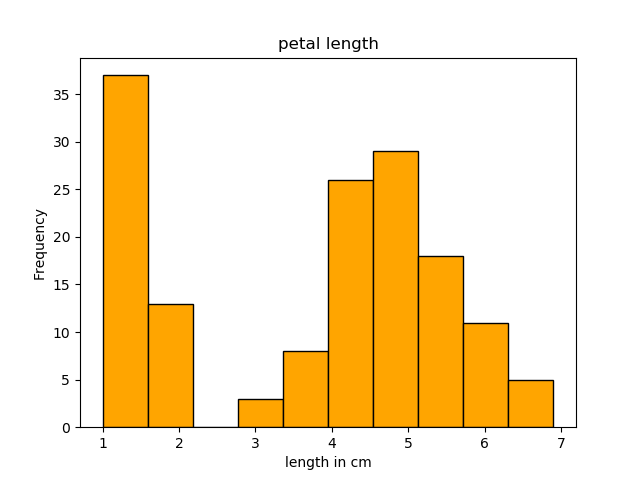
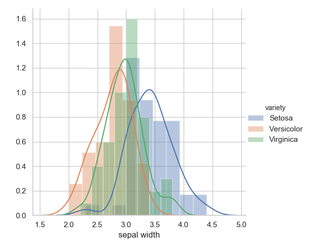

# Programming and Scripting - Project 2020
# Iris Flower Data Set - A Summary - Author: Killian Foley

## Introduction
The Iris flower data set is a multivariate data set introduced by the British statistician and biologist Ronald Fisher in his 1936 paper *The use of multiple measurements in taxonomic problems*. It is sometimes called Anderson’s Iris data set because Edgar Anderson collected the data to quantify the morphologic variation of Iris flowers of three related species. Two of the three species were collected in the Gaspé Peninsula “all from the same pasture, and picked on the same day and measured at the same time by the same person with the same apparatus”. (https://en.wikipedia.org/wiki/Iris_flower_data_set)

## The Data Set
The data set consists of 50 samples from each of three species of Iris Flower (Iris Setosa, Iris Virginica and Iris Versicolor). Four features were measured from each sample: sepal length, sepal width, petal length and petal width, in centimetres. The data set was downloaded from the following link [Iris dataset.csv](https://tableconvert.com/?output=csv)

## Running the Python Program
The python program is entitled *analysis.py*. To run the code one must navigate to the directory containing the program via the command line and execute the command *python analysis.py* on the command line (terminal). The output of the code is explained in detail below.

## Explaining The Code
### Python Libraries Used
`import pandas as pd`  
`import matplotlib.pyplot as plt`  
`import numpy as np`  
`import seaborn as sns`  

The **pandas** library is used to perform several useful functions in this project. It reads in the initial data from a .csv file, saves it as a *dataframe*, creates a summary of the data and writes that summary to a text file.  
  
**matplotlib.pyplot** is used to plot a histogram for each variable.  
  
**seaborn** is used to plot the scatterplot matrix x 2 and violinplots

### Data Import
The data is read in using function from pandas and first 10 lines are displayed.  

`df = pd.read_csv("iris_data_set.csv")`  
`df.columns = ["sepal length", "sepal width", "petal length", "petal width", "variety"]`

`#head() command shows first x number of lines. Specify number in bracket`  
`print(df.head(10))`  
  
|   | sepal length  | sepal width  | petal length  | petal width |variety|
|---|:-------------:|:------------:|:-------------:|:-----------:|:-----:|
| 0           | 5.1          |3.5          | 1.4          |0.2  |Setosa|  
| 1           | 4.9          |3.0          | 1.4          |0.2  |Setosa|  
| 2           | 4.7          |3.2          | 1.3         | 0.2  |Setosa|  
| 3           | 4.6          |3.1          | 1.5         | 0.2  |Setosa|  
| 4           | 5.0          |3.6          | 1.4         | 0.2  |Setosa|  
| 5           | 5.4          |3.9          | 1.7         | 0.4  |Setosa|  
| 6           | 4.6          |3.4          | 1.4         | 0.3  |Setosa|  
| 7           | 5.0          |3.4          | 1.5         | 0.2  |Setosa|  
| 8           | 4.4          |2.9          | 1.4         | 0.2  |Setosa|  
| 9           | 4.9          |3.1          | 1.5         | 0.1  |Setosa|  
  
### Information about the Data Set
Display the number of rows and columns.  
  
`print(df.shape)`  
  
Output: (150, 5)
  
### Display the Unique Flower Varieties
`df["variety"].unique()`  
`print(df.groupby("variety").size())`

Output:  
Setosa:  50  
Versicolor: 50  
Virginica:  50  
dtype:  int64  

### Create a Summary of Each Variable
`summary = df.describe(include="all")`  
`summaryt = summary.transpose()`  
  
|           |count    |unique | top | freq | mean     |std  |min  |25%   |50%  |75%  |max
|    ---    |:---:|:---:|:---:|:---:|:---:|:---:|:---:|:---:|:---:|:---:|:---:   
**sepal length**  |150.0 | NaN | NaN | NaN |5.8433  |0.8281  |4.3  |5.1  |5.80  |6.4  |7.9
**sepal width**   |150.0 | NaN | NaN | NaN  |3.0573  |0.4359  |2.0  |2.8  |3.00  |3.3  |4.4
**petal length**  |150.0 | NaN | NaN | NaN  |3.7580  |1.7653  |1.0  |1.6  |4.35  |5.1  |6.9
**petal width**   |150.0 | NaN | NaN | NaN  |1.1993  |0.7622  |0.1  |0.3  |1.30  |1.8  |2.5
**variety** |150 | 3 | Virginica | 50 | NaN | NaN | NaN | NaN | NaN | NaN | NaN
  
### Write the Summary to a Single Text File
`summaryt.to_csv("summary.txt", sep=',')`
### Histograms
From the petal length and less so the petal width histograms we see that one of the flower varieties is distinguishable with a near 100% accuracy. The identity of the flower variety and the confirmation of this observation will be visibile in the scatter plots and violin plots.  
    
  
  
  
  
  
  
  
  
### Histogramswith Probability Density Function (PDF)
Overlaying the Probability Denisty Function on the Histograms we can see from the petal length plot that  
*if petal length < 2.1 then variety is "Setosa" probability of 100%*  
*else if petal length > 2.1 and petal length < 5 then variety is "Versicolor" probablity of ~90%*  
*else if petal length > 4.8 then variety is "Virginica probablity of ~+90%*  
    
  
  
  
  
  
  
  
  
### 

## References
Introduction and information https://en.wikipedia.org/wiki/Iris_flower_data_set  
Transpose Function https://note.nkmk.me/en/python-pandas-t-transpose/  
Analysis of Iris in Python https://medium.com/codebagng/basic-analysis-of-the-iris-data-set-using-python-2995618a6342  
Histogram Formatting https://stackoverflow.com/questions/42542252/cannot-get-histogram-to-show-separated-bins-with-vertical-lines  

